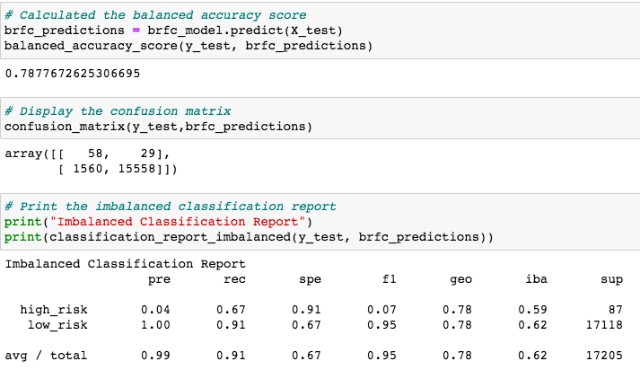

# Credit_Risk_Analysis

## Overview
The purpose of this analysis is to employ different machine learning techniques to train and evaluate models with unbalanced classes to predict the risk of credit card customers. In this challenge, imbalanced-learn and scikit-learn libraries are used to build and evaluate models using resampling.

## Results

### Naive Random Sampling

The balanced accuracy score for this model is 63.27% and for the low_risk analysis, the precision is 1.00 and the recall is 0.63, which indicates a low number of false negatives, although the f1 score is high at 0.77.  

### SMOTE Oversampling

The balanced accuracy score for this model is 66.41% where the low_risk precision is 1.00 and the recall is 0.66. The results are very similar to the results of the naive random sampling model. 

### Cluster Centroids

The balanced accuracy score for this model is 51.02%, which is lower than the oversampling methods. For low risk, the precision is 1.00 and the recall is 0.43, which is indicative of a larger number of false negatives.

### SMOTEENN

The balanced accuracy score for this model is 61.91% and the precision is 1.00 and the recall is 0.56. The accuracy score and recall for this model are lower than the oversampling methods, but higher than the Cluster Centroids undersampling model.

### Balanced Random Forest

The balanced accuracy score for this model is 78.77% and the precision is 1.00 and the recall is 0.91, which is indicative of a low number of false negatives. The f1 score is very high at 0.95.

### Easy Ensemble AdaBoost

The balanced accuracy score for this model is 92.54% and the precision is 1.00 and the recall is 0.94 for low risk, which is indicative of a low number of false negatives. The recall for high risk is very high at 0.91. The f1 score is very high at 0.97, coming in as the best model to accurately predict credit risk.

## Summary
Summarize the results of the machine learning models, and include a recommendation on the model to use, if any. If you do not recommend any of the models, justify your reasoning.

The Easy Ensemble AdaBoost Classifier is the best model to predict credit risk for LendingClub to adopt. I recommend scaling the data prior to applying this model due to differences in sampling size.  